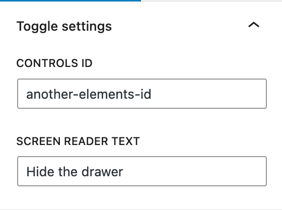
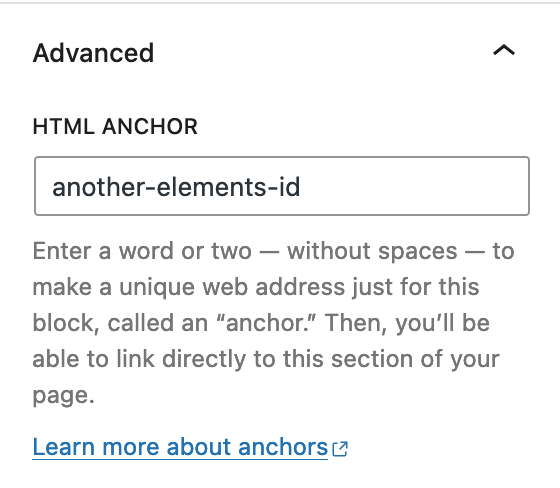

# Toggle Block

Add a toggle in the WordPress block editor to show and hide another block.

## Usage

Toggle Block is a very rudimentary block. It renders as a `<button>` element on the front-end that is used to show or hide another target element (via its ID) on the page. It uses `aria-controls` and `aria-label` in an attempt to make it compatible with assistive technology.

The intended use is in a site's template, through the site editor or your theme files, rather than as a block that is frequently used in content.

When the toggle block is selected in the editor, toggle settings appear in the sidebar panel:

The "Controls ID" entered in this panel must match the "HTML anchor" assigned to another block through its advanced panel:

## Changelog

### 0.6.0

* Add toggle group support: when toggle blocks are inside a container with the `toggle-block-group` class, activating one toggle automatically closes others in the group.
* Add a "Default toggle" option to mark which toggle should be active by default in a group.
* Extend block supports to match paragraph and heading blocks: add font family, font style, font weight, letter spacing, text decoration, text transform, writing mode, border, and link color support.
* Only render `aria-label` when screen reader text is provided, allowing the button text to serve as the accessible name by default.
* Use `aria-expanded` instead of both `aria-pressed` and `aria-expanded` for toggle state.
* Update to latest dependencies, build process, and code standards.

### 0.5.0

* Wrap button text in a `` element to help with styling.
* Move editor styles to an editor-only stylesheet.
* Update to latest dependencies, build process, and code standards.

### 0.4.0

* Add an attribute to toggle a toggle block-specific class on the body element.
* Allow the toggle block to be placed inside the `core/navigation` block.
* Add transform support from/to `core/navigation-link` blocks.
* Update to latest dependencies, build process, and code standards.

### 0.3.1

* Add persisting `toggle-block-has-been-toggled` class to toggled element when first toggled.

### 0.3.0

* Add persisting `toggle-block-has-toggled` class to toggle button when first clicked.
* Update `@wordpress/scripts` to 27.7.0.
* Update project dependencies.
