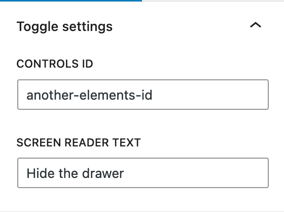

# Toggle Block

Add a toggle in the WordPress block editor to show and hide another block.

## Usage

Toggle Block is a very rudimentary block. It renders as a `<button>` element on the front-end that is used to show or hide another target element (via its ID) on the page. It uses `aria-controls` and `aria-label` in an attempt to make it compatible with assistive technology.

The intended use is in a site's template, through the site editor or your theme files, rather than as a block that is frequently used in content.

When the toggle block is selected in the editor, toggle settings appear in the sidebar panel:

The "Controls ID" entered in this panel must match the "HTML anchor" assigned to another block through its advanced panel:

